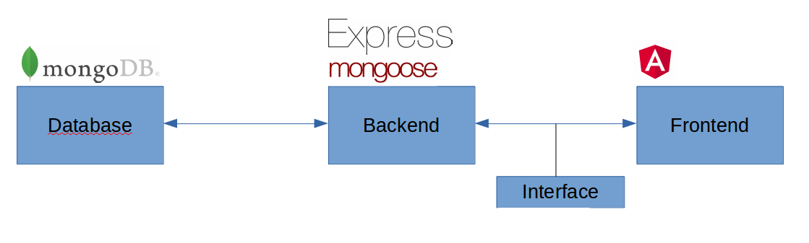

# chumm-uffa
Meeting platform for climbers

Ziel der Plattform ist es, Treffen von und für Kletterer zu organisieren. Möchte jemand eine Kletter-Tour im Freien oder 
in der Halle organisieren ist er hier genau richtig. Nach dem Registrieren können beliebige Meetups erstellt werden, 
worauf sich anschliessend interessierte Personen registrieren können. Eine Suchfunktion unterstützt beim finden
von interessanten Meetups ein deiner Region.   

## Übersicht
Die Anwendung besteht aus vier Teil-Bereichen:



#### Frontend
Das Frontend ist für sämtliche Interaktionen mit dem Benutzer zuständig. Ist mit Hilfe von [Angular 5](https://angular.io/) 
und [Angular Material](https://material.angular.io/) entwickelt.      
#### Backend
Das Backend stellt eine [Rest-API](./doc/rest-api.txt) zur Verfügung, um auf die Daten der Anwendung zugreifen zu können. 
Ist in [TypeScript](https://www.typescriptlang.org/) geschrieben und verwendet [Express](https://www.npmjs.com/package/express). 
Für den Zugriff auf die [MongoDB](https://www.mongodb.com/) wird [mongoose](http://mongoosejs.com/) eingesetzt.  
#### Interface 
Beschreibt die Schnittstelle zwischen Backen und Frontend.
#### Database
Zuständig für die Datenhaltung. Eine [MongoDB](https://www.mongodb.com/) wird hier verwendet.

## Installation
Die Anwendung kann auf verschiedene Arten installierte werden:
### npm
Um die Anwendung via npm zu starten muss lokal [nodejs](https://nodejs.org/en/download/) installiert sein. Entwickelt und 
getestet wurde mit Version 8.9 .   
##### 1. Interface erstellen
Als erstes muss das Interface erstellt werden, da Backend und Frontend dies benötigen. 
```
    $ cd ./interface
    $ npm install
    $ npm run build
```
##### 2. MongoDB
Das Backend speichert seine Daten in einer MongoDB. Entweder auf dem Rechner oder im Netz muss somit eine Instanz einer 
MongoDB vorhanden sein. Für die lokale Installation kann [hier](https://www.mongodb.com/download-center#community) die
aktuelle Version bezogen werden. Alternativ steht auch ein Docker Container mit MondoDB zu Verfügung der wie folgt gestartet
wird (Voraussetzung ist das [Docker](https://docs.docker.com/engine/installation/) und 
[Docker-Compose](https://docs.docker.com/compose/install/ ) vorhanden sind):
```
    $ cd ./data
    $ docker-compose up
```
##### 3. Backend starten
Bevor das Backend gestartet wird, müssen eventuell einige Einstellungen angepasst werden. In der Datei ./backend/.env sind
die wichtigsten Einstellungen zu finden. Hier wird auch die Anbindung der MondoDB konfiguriert, falls sich diese nicht 
auf dem lokalen Rechner befindet.  
Sind alle Einstellungen korrekt, kann das Backend wie folgt gestartet werden:
```
    $ cd ./backend
    $ npm install
    $ npm run start
```
##### 4. Frontend starten
Nach dem Backend kann nun auch das Frontend gestartet werden:
```
    $ cd ./frontend
    $ npm install
    $ npm run start
```
Die Anwendung ist nach dem Starten via [http://localhost:4200](http://localhost:4200) verfügbar. 
### docker
Die Anwendung wir aus als Docker Image zur Verfügung gestellt. 
* [frontend](https://hub.docker.com/r/pepeblack/chumm-uffa-frontend/)
* [backend](https://hub.docker.com/r/pepeblack/chumm-uffa-backend/)

Frontend und Backend sind in zwei unterschiedlichen Kontainer verfügbar. Somit ist in einem 
späteren produktiven Einsatz eine saubere Trennung von Frontend und Backend möglich.
Um die Container zu starten müssen Docker CE und Docker-Compose installiert sein.

* Docker CE: https://docs.docker.com/engine/installation/
* Docker Composer: https://docs.docker.com/compose/install/

Anschliessen im Root Verzeichniss folgenden Befehl ausführen um die Anwendung zu starten:
```
    $ docker-compose up
```
Neben Frontend und Backend wird auch gleich ein Container mit MondoDB erstellt und gestartet.

Die Anwendung ist nach dem Starten via [http://localhost](http://localhost) verfügbar. 
